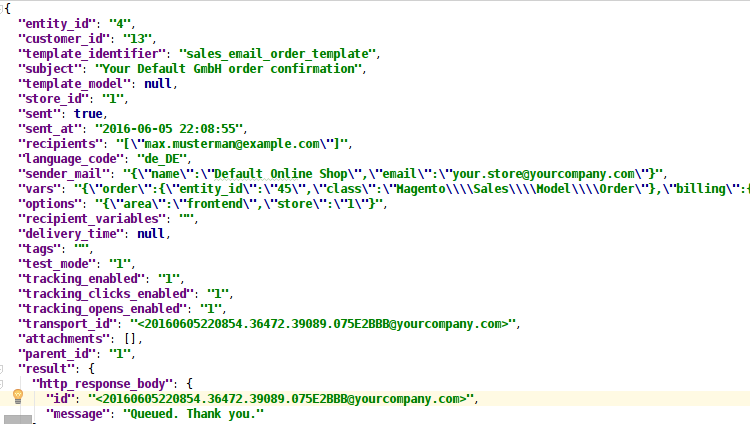

# Magento 2 enhanced mailing module

This module enhances the magento 2 capabilities to send transactional mails.
In a plain magento 2 installation it is neither possible to track and manage 
transactional emails sent by magento 2 system, nor it is possible to store 
mails locally or at backup service providers.

This mailing module distinguishes between parts of email processing:

- A mail transport system which takes care of transport of outgoing mails 
  to a mail service provider and retrieval of returning meta data for 
  mails entities.
  
- A mail storeage system which takes care of storing the data of outgoing
  mails and its metadata on file-systems.
  

As well the implemented transport system as the storeage system consist
of a configurable base class for Magento 2 and a second class for dynamic 
loaded plugin classes which performs the actual transport.
Therefore it is possible to keep the rich basic functionality of this mail 
module and to enhance it by vendor specific functionality.


## Installation

Add the module to your composer file.

```json
{
  "require": {    
    "shockwavemk/magento2-module-mail": "dev-master"
  }
}

```

Install the module with composer.

```bash

    composer update

```

On succeed, install the module via bin/magento console.

```bash

    bin/magento cache:clean
    
    bin/magento module:install Shockwavemk_Mail_Base
    
    bin/magento setup:upgrade

```


## Features

### Mail sending over configurable plugins

Supported vendors (so far):

Transport:

- Any SMTP server
- Mailgun

Storage:

- Local server storeage
- Dropbox


### Storeage of mail meta data in database


### Storeage of mail data as json files

Each mail sent by magento 2 is stored individual as json file.



Additional a rendered version of each mail is stored as .hmtl file.
This reduces loading times on review and enables external storeage
systems to preview content stored.

The default storeage stores all files sent by magento2 in a so called
"spool" folder. The mail data will stay at this local server path until 
it is deleted or moved.


### Enhance admin customer management by transactional mail review


### Re-Sending of transactional mails. Re-Calculated or Re-Sending of stored mail data


### Attachment handling, storeage of sent files

